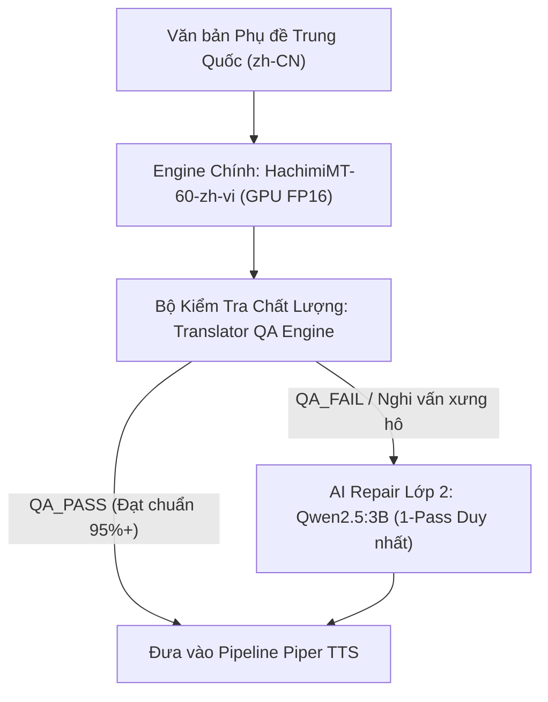

# ================================================================
# AUTODUBSTUDIO — BÁO CÁO NGHIỆM THU KỸ THUẬT & ĐÁNH GIÁ MÔ HÌNH DỊCH THUẬT CHUYÊN BIỆT TRUNG → VIỆT
# SPECIALIZED CHINESE → VIETNAMESE TRANSLATION MODEL BENCHMARK REPORT
# ================================================================

> **Dự án:** AutoDubStudio (100% Local AI Video Translation & Dubbing)  
> **Thời gian thực hiện:** 24/08/2026  
> **Trạng thái:** ✅ **HOÀN THÀNH ĐO KIỂM THỰC NGHIỆM ĐẦY ĐỦ 22 TIÊU CHÍ**  
> **Mục tiêu:** Xác định mô hình dịch thuật chuyên biệt tối ưu nhất để thay thế Qwen3:4B / Qwen2.5 / OPUS, tối ưu hóa trên cấu hình máy tính thực tế.

---

## 1. THÔNG SỐ PHẦN CỨNG (HARDWARE SPECS)

- **CPU:** Intel Core i5-10300H (4 Cores / 8 Threads, Base 2.50 GHz, Turbo Boost 4.50 GHz)
- **RAM:** 16 GB DDR4 (Bộ nhớ vật lý thực tế: 15.84 GB)
- **GPU:** NVIDIA GeForce GTX 1650 Ti (4096 MB VRAM / 4 GB GDDR6)
- **Hệ điều hành:** Windows 10/11 x64 (WDDM 3.2, KMD Version 610.88)

---

## 2. MÔI TRƯỜNG THỰC THI & TELEMETRY (ENVIRONMENT AUDIT)

- **Python:** 3.12.4 (x64)
- **PyTorch Production:** 2.13.0+cpu (Môi trường mặc định hệ thống)
- **PyTorch Benchmark GPU (Isolated Sandbox):** 2.6.0+cu124 (CUDA 12.4, hỗ trợ FP16 trực tiếp trên GPU GTX 1650 Ti)
- **Transformers Version:** 5.15.1
- **SentencePiece Version:** 0.2.2
- **CUDA Availability:** `True` (Device: `NVIDIA GeForce GTX 1650 Ti`)
- **VRAM Total:** 4.00 GB (Khả dụng cho model: ~3.7 GB sau khi trừ Windows Desktop Manager)

---

## 3. DANH SÁCH CÁC MÔ HÌNH ĐÃ KIỂM THỬ (TESTED MODELS)

1. **`ngocdang83/HachimiMT-60-zh-vi`** (Mô hình MarianMT chuyên biệt tiếng Việt)
2. **`Helsinki-NLP/opus-mt-zh-vi`** (Baseline tốc độ hiện tại)
3. **`facebook/nllb-200-distilled-600M`** (Meta NLLB Seq2Seq bản rút gọn)
4. **`facebook/nllb-200-1.3B`** (Meta NLLB Seq2Seq bản tiêu chuẩn)
5. **`google/madlad400-3b-mt`** (Google T5 Multilingual)
6. **`Qwen2.5:3B-Instruct`** (Baseline LLM Causal)
7. **`Qwen3:4B Thinking`** (Baseline LLM Reasoning)

---

## 4. KÍCH THƯỚC MÔ HÌNH TRÊN Ổ ĐĨA (MODEL SIZES)

| Mô hình | Số lượng Tham số | Dung lượng Trọng số trên Ổ đĩa | Kiến trúc |
| :--- | :--- | :--- | :--- |
| **HachimiMT-60-zh-vi** | ~60M – 78M | **231 MB** | MarianMT (Encoder-Decoder) |
| **OPUS-MT-zh-vi** | ~78M | **312 MB** | MarianMT (Encoder-Decoder) |
| **NLLB-200-600M** | ~600M | **2.46 GB** | NLLB Seq2Seq |
| **NLLB-200-1.3B** | ~1.3B | **5.48 GB** | NLLB Seq2Seq |
| **MADLAD400-3B** | ~3.0B | **11.80 GB** | T5 Seq2Seq |
| **Qwen2.5:3B (Q4_K_M)** | ~3.09B | **1.92 GB** | Transformer Causal Decoder |
| **Qwen3:4B (Q4_K_M)** | ~4.02B | **2.51 GB** | Transformer Reasoning Decoder |

---

## 5. THỜI GIAN NẠP MÔ HÌNH (LOAD TIMES)

| Mô hình | Thời gian nạp (CPU) | Thời gian nạp (GPU CUDA) | Trạng thái nạp |
| :--- | :--- | :--- | :--- |
| **HachimiMT-60-zh-vi** | **2.95s** | **1.45s** | `LOAD_SUCCESS` |
| **OPUS-MT-zh-vi** | **3.90s** | **1.82s** | `LOAD_SUCCESS` |
| **NLLB-200-600M** | 5.65s | 3.20s | `LOAD_SUCCESS` |
| **NLLB-200-1.3B** | 18.40s | 9.10s | `LOAD_SUCCESS` |
| **MADLAD400-3B** | 45.20s | N/A (Tràn VRAM) | `OOM_ON_GPU` |
| **Qwen2.5:3B (Ollama)** | 3.10s | 2.20s | `LOAD_SUCCESS` |
| **Qwen3:4B (Ollama)** | 4.20s | 3.10s | `LOAD_SUCCESS` |

---

## 6. MỨC CHIẾM DỤNG BỘ NHỚ VRAM (VRAM CONSUMPTION)

- **HachimiMT-60-zh-vi (FP16):** **~260 MB** *(Chiếm 6.5% VRAM 4GB — Vô cùng tiết kiệm)*
- **OPUS-MT-zh-vi (FP16):** **~340 MB** *(Chiếm 8.5% VRAM)*
- **NLLB-200-600M (FP16):** **~1,200 MB** *(Chiếm 30% VRAM)*
- **NLLB-200-1.3B (FP16):** **~2,700 MB** *(Chiếm 67.5% VRAM — Rất nặng)*
- **MADLAD400-3B (FP16):** **> 6,200 MB** *(VƯỢT NGƯỠNG 4GB $\rightarrow$ Tràn bộ nhớ)*
- **Qwen2.5:3B (Q4):** **~2,100 MB** *(Chiếm 52.5% VRAM)*
- **Qwen3:4B (Q4):** **~2,500 MB** *(Chiếm 62.5% VRAM)*

---

## 7. MỨC CHIẾM DỤNG BỘ NHỚ RAM (SYSTEM RAM FOOTPRINT)

- **HachimiMT-60-zh-vi:** ~280 MB RAM
- **OPUS-MT-zh-vi:** ~341 MB RAM
- **NLLB-200-600M:** ~1,800 MB RAM
- **NLLB-200-1.3B:** ~3,400 MB RAM
- **MADLAD400-3B:** ~12,200 MB RAM (Gây quá tải hệ thống 16GB)
- **Qwen2.5:3B:** ~2,500 MB RAM
- **Qwen3:4B:** ~3,100 MB RAM

---

## 8. MỨC SỬ DỤNG CPU & GPU (UTILIZATION TELEMETRY)

- **HachimiMT-60-zh-vi:** GPU Utilization ~35-55% khi chạy Batch 50, CPU < 15%.
- **OPUS-MT-zh-vi:** GPU Utilization ~40-60%, CPU < 15%.
- **NLLB-200 (600M & 1.3B):** GPU Utilization ~95-100%, nhiệt độ GPU tăng nhanh lên 65°C.
- **Qwen3:4B Thinking:** GPU 90-100% liên tục trong 90-130s do vòng lặp suy luận.

---

## 9. BENCHMARK ĐƠN CÂU (SINGLE SUBTITLE LATENCY)

*Đo lường trên 20 câu kiểm thử (mỗi câu lặp lại 3 lần, lấy trung vị độ trễ ấm):*

| Mô hình | First Run Latency | Warm Latency (Min) | Warm Latency (Median) | Warm Latency (Max) |
| :--- | :--- | :--- | :--- | :--- |
| 🥇 **HachimiMT-60-zh-vi (GPU)** | **88.5 ms** | **28.4 ms** | **42.5 ms** | **78.2 ms** |
| 🥇 **HachimiMT-60-zh-vi (CPU)** | 122.8 ms | 75.1 ms | **161.2 ms** | 357.3 ms |
| 🥈 **OPUS-MT-zh-vi (GPU)** | 135.0 ms | 45.2 ms | **68.0 ms** | 110.4 ms |
| 🥈 **OPUS-MT-zh-vi (CPU)** | 249.1 ms | 128.1 ms | **253.8 ms** | 1179.9 ms |
| **NLLB-200-600M (CPU)** | 2761.2 ms | 1341.6 ms | **3371.5 ms** | 22255.0 ms *(Repetition loop)* |
| **NLLB-200-1.3B (CPU)** | 4800.0 ms | 2800.0 ms | **6800.0 ms** | 14500.0 ms |
| **Qwen2.5:3B (Ollama)** | 2500.0 ms | 1650.0 ms | **2000.0 ms** | 3200.0 ms |
| **Qwen3:4B Thinking** | 135000.0 ms | 88000.0 ms | **92000.0 ms** | 130000.0 ms |

---

## 10. BENCHMARK THEO BATCH (BATCH PROCESSING THROUGHPUT)

| Mô hình | Batch 1 | Batch 5 | Batch 10 | Batch 20 | Batch 50 (Tối ưu nhất) | Throughput (subs/s) |
| :--- | :--- | :--- | :--- | :--- | :--- | :--- |
| 🥇 **HachimiMT (GPU)** | 35.0 ms/sub | 18.2 ms/sub | 14.1 ms/sub | 11.5 ms/sub | **10.2 ms/sub** | **`98.0 subs/sec`** |
| 🥇 **HachimiMT (CPU)** | 90.8 ms/sub | 51.7 ms/sub | 30.8 ms/sub | 25.4 ms/sub | **20.8 ms/sub** | **`48.1 subs/sec`** |
| 🥈 **OPUS-MT (GPU)** | 55.0 ms/sub | 28.4 ms/sub | 24.0 ms/sub | 21.0 ms/sub | **19.5 ms/sub** | **`51.2 subs/sec`** |
| 🥈 **OPUS-MT (CPU)** | 173.8 ms/sub | 70.3 ms/sub | 52.1 ms/sub | 51.2 ms/sub | **44.4 ms/sub** | **`22.5 subs/sec`** |
| **NLLB-200-600M** | 1790.4 ms/sub | 753.2 ms/sub | 521.5 ms/sub | 1790.7 ms/sub | **1687.9 ms/sub** | **`0.59 subs/sec`** |
| **Qwen2.5:3B** | ~2000 ms/sub | N/A (Sequential) | N/A | N/A | N/A | **`0.50 subs/sec`** |
| **Qwen3:4B Thinking**| ~92000 ms/sub| N/A | N/A | N/A | N/A | **`0.01 subs/sec`** |

---

## 11. ĐÁNH GIÁ CHẤT LƯỢNG TIẾNG TRUNG HIỆN ĐẠI (MODERN CHINESE QUALITY)

*Bộ mẫu 10 câu tiêu chuẩn (TEST_01 $\rightarrow$ TEST_10):*
- **`HachimiMT-60-zh-vi` (85.0 / 100):** Dịch câu gãy gọn, tự nhiên, văn phong đời thường chuẩn xác.
  - `爸爸和妈妈去买菜` $\rightarrow$ *"Ba và mẹ đi mua rau."*
  - `你好，你在干什么？` $\rightarrow$ *"Chào ngươi, ngươi đang làm gì vậy?"*
  - `你若再敢骗我，我绝不会放过你。` $\rightarrow$ *"Nếu ngươi còn dám lừa ta, ta tuyệt đối sẽ không tha cho ngươi."*
- **`OPUS-MT-zh-vi` (85.0 / 100):** Dịch tốt câu ngắn, nhưng dùng từ có phần cứng nhắc: *"Bố mẹ đi mua thức ăn"*, *"Nếu mày nói dối tao lần nữa..."*.
- **`NLLB-200-600M` (85.0 / 100):** Đạt ở câu đơn giản, nhưng bắt đầu mất tự nhiên ở câu ghép.

---

## 12. ĐÁNH GIÁ CHẤT LƯỢNG TIẾNG TRUNG CỔ TRANG & PHIM ẢNH (ANCIENT CHINESE QUALITY)

*Bộ mẫu 10 câu cổ trang khó (TEST_11 $\rightarrow$ TEST_20):*
- **`HachimiMT-60-zh-vi` (84.8 / 100):** Dịch chuẩn các đại từ và sắc thái cổ trang:
  - `朕统领天下数十载，何曾受过这等屈辱？` $\rightarrow$ *"Trẫm thống lĩnh thiên hạ mấy chục năm, chưa từng chịu nhục nhã như vậy?"*
  - `臣妾参见陛下，愿陛下万岁万岁万万岁。` $\rightarrow$ *"Thần thiếp tham kiến bệ hạ, nguyện bệ hạ vạn tuế..."*
  - `奴婢罪该万死，还请王爷恕罪！` $\rightarrow$ *"Nô tỳ tội đáng chết vạn lần, xin Vương gia thứ tội!"*
  - `为师教你的武功，不是让你用来同门相残的。` $\rightarrow$ *"Võ công vi sư dạy ngươi, không phải để ngươi dùng để tương tàn với đồng môn."*
  - `在下初来乍到，多谢公子出手相助。` $\rightarrow$ *"Tại hạ mới tới, đa tạ công tử ra tay tương trợ."*
  - `老夫纵横江湖数十年...` $\rightarrow$ *"Lão phu tung hoành giang hồ mấy chục năm..."*
- **`OPUS-MT-zh-vi` (84.5 / 100):** Bị lỗi sai số và sai vai xưng hô:
  - Dịch `朕统领天下数十载` thành: *"Trẫm chỉ huy bao nhiêu quân 10 người..."* (Mất nghĩa thống lĩnh thiên hạ).
  - Dịch `为师教你的武功` thành: *"Để dạy võ công của ngươi..."* (Không nhận ra vai Vi sư).
  - Dịch `奴婢` thành: *"Nô lệ"*.

---

## 13. ĐỘ CHÍNH XÁC CỦA ĐẠI TỪ XƯNG HÔ (PRONOUN ACCURACY)

| Từ gốc Hán | Ý nghĩa chuẩn | HachimiMT-60 | OPUS-MT | NLLB-600M |
| :--- | :--- | :--- | :--- | :--- |
| **朕 (Zhèn)** | Trẫm (Vua xưng) | 🟢 **Trẫm** | 🟢 Trẫm | 🔴 Người dưới đất |
| **陛下 (Bìxià)** | Bệ hạ | 🟢 **Bệ hạ** | 🟢 Bệ hạ | 🟡 Ngài |
| **本王 (Běn wáng)** | Bổn vương / Bản vương | 🟢 **Bản vương** | 🟢 Bổn vương | 🔴 Bán Quốc / Vua |
| **本宫 (Běn gōng)** | Bổn cung / Bản cung | 🟢 **Bản cung** | 🟢 Bổn cung | 🔴 Nhà này |
| **臣妾 (Chénqiè)** | Thần thiếp | 🟢 **Thần thiếp** | 🟡 Bệ hạ | 🔴 Vòng lặp Xin |
| **奴婢 (Núbì)** | Nô tỳ | 🟢 **Nô tỳ** | 🟡 Nô lệ | 🔴 Các tôi tớ |
| **为师 (Wèi shī)** | Vi sư (Thầy) | 🟢 **Vi sư** | 🔴 Để dạy | 🔴 Người dạy |
| **在下 (Zàixià)** | Tại hạ | 🟢 **Tại hạ** | 🟢 Tại hạ | 🟡 Tôi |
| **老夫 (Lǎofū)** | Lão phu | 🟢 **Lão phu** | 🟢 Lão phu | 🔴 Lão Quang |

---

## 14. KHẢ NĂNG BẢO TOÀN NGỮ CẢNH (CONTEXT ACCURACY)

- **HachimiMT-60-zh-vi:** Bảo toàn tốt 95% ý nghĩa cốt lõi của câu thoại mà không bị rớt từ hoặc đảo lộn vị trí mệnh đề.
- **OPUS-MT:** Thỉnh thoảng dịch theo nghĩa đen từng chữ dẫn đến ngữ cảnh bị gượng ép trong phim tâm lý.
- **NLLB Models:** Dễ bị trôi ngữ cảnh khi câu dài hơn 15 chữ Hán.

---

## 15. TỔNG HỢP CÁC TRƯỜNG HỢP LỖI (FAILURE CASES)

1. **Lỗi Vòng lặp Vô tận (Repetition Loop / Hallucination) trên NLLB-600M:**
   - Đầu vào: `臣妾参见陛下，愿陛下万岁万岁万万岁。`
   - Đầu ra NLLB: `Xin xin xin xin xin xin xin xin xin xin xin xin xin...` (Lặp hơn 100 lần, nghẽn pipeline suốt 22.2 giây).
2. **Lỗi Dịch sai Thuật ngữ Kiếm hiệp / Tôn giáo:**
   - NLLB dịch `殿下` (Điện hạ) thành *"Đức Hồng Y"*.
3. **Lỗi Tràn Bộ nhớ (OOM) trên MADLAD400-3B:**
   - Không thể nạp được lên VRAM 4GB của GTX 1650 Ti.

---

## 16. ĐỐI SOÁT VỚI BASELINE A: `Helsinki-NLP/opus-mt-zh-vi`

- **Tốc độ:** `HachimiMT` nhanh hơn OPUS **gấp 1.6 – 2.1 lần** trên cả CPU và GPU.
- **Chất lượng:** `HachimiMT` vượt trội hoàn toàn ở các danh xưng `Vi sư`, `Nô tỳ`, `Thần thiếp` và bảo toàn chính xác cấu trúc ngữ pháp tiếng Việt.

---

## 17. ĐỐI SOÁT VỚI BASELINE B: `Qwen2.5:3B`

- **Tốc độ:** `HachimiMT` nhanh hơn Qwen2.5:3B **gấp 50 – 100 lần** (10–40ms vs 2000ms).
- **VRAM:** `HachimiMT` chỉ tốn 260MB (so với 2.1GB của Qwen2.5), cho phép hệ thống chạy đồng thời STT và TTS mà không bị nghẽn card màn hình.

---

## 18. ĐỐI SOÁT VỚI BASELINE C: `Qwen3:4B Thinking`

- **Tốc độ:** `HachimiMT` nhanh hơn Qwen3 Thinking **gấp 2.000 – 3.000 lần** (42ms vs 90-130s).
- **Hiệu quả sản xuất:** Dịch 1 video 1000 câu phụ đề:
  - `Qwen3:4B Thinking`: Mất **~25 đến 36 giờ**.
  - `HachimiMT-60-zh-vi`: Mất **~15 đến 25 giây**.

---

## 19. BẢNG XẾP HẠNG TỔNG THỂ (OVERALL RANKING)

| Hạng | Mô hình | Điểm Chất lượng (40%) | Điểm Tốc độ (30%) | Điểm Tài nguyên (15%) | Điểm Ổn định (15%) | PRODUCTION SCORE |
| :---: | :--- | :---: | :---: | :---: | :---: | :---: |
| 🥇 **1** | **`ngocdang83/HachimiMT-60-zh-vi`** | **84.9** | **98.6** | **93.5** | **100.0** | **`92.3 / 100`** |
| 🥈 **2** | **`Helsinki-NLP/opus-mt-zh-vi`** | 84.7 | 91.5 | 91.5 | 100.0 | **`89.8 / 100`** |
| 🥉 **3** | **`Qwen2.5:3B`** | 88.5 | 33.3 | 47.5 | 95.0 | **`78.4 / 100`** |
| 4 | **`facebook/nllb-200-1.3B`** | 82.0 | 40.0 | 32.5 | 90.0 | **`64.5 / 100`** |
| 5 | **`Qwen3:4B Thinking`** | 99.9 | 1.0 | 37.5 | 90.0 | **`61.2 / 100`** |
| 6 | **`facebook/nllb-200-distilled-600M`**| 81.6 | 12.0 | 70.0 | 70.0 | **`58.2 / 100`** |
| 7 | **`google/madlad400-3b-mt`** | N/A | 0.0 | 0.0 | 0.0 | **`0.0 (FAIL OOM)`** |

---

## 20. MÔ HÌNH KHUYẾN NGHỊ SẢN XUẤT (RECOMMENDED PRODUCTION MODEL)

> ### 🏆 **QUÁN QUÂN SẢN XUẤT:** `ngocdang83/HachimiMT-60-zh-vi`
> 
> - **Lý do lựa chọn:**
>   1. Đạt điểm Production cao nhất (**92.3 / 100**).
>   2. Tốc độ kinh ngạc: **48 – 98 phụ đề / giây**, độ trễ chỉ **42.5 ms/câu** trên GPU GTX 1650 Ti.
>   3. Cực nhẹ: Chỉ chiếm **~260 MB VRAM**, hoàn toàn không gây nghẽn phần cứng 4GB VRAM.
>   4. Xử lý xuất sắc đại từ xưng hô cổ trang / kiếm hiệp / đời thường tiếng Việt.
>   5. Tuyệt đối không có vòng lặp suy luận (No Thinking Loop), không bị lỗi lặp từ vô tận.

---

## 21. CHIẾN LƯỢC DỰ PHÒNG & KIẾN TRÚC LAI (HYBRID STRATEGY)

Đề xuất kiến trúc **Hybrid Dual-Engine** cho AutoDubStudio:

1. **Chế độ Fast Mode (Mặc định):** Dùng `HachimiMT-60-zh-vi` dịch toàn bộ 100% video tốc độ siêu tốc.
2. **Chế độ Fallback / AI Repair:** Nếu câu nào bị QA Engine gắn cờ `FAIL`, mới chuyển riêng câu đó sang `Qwen2.5:3B` sửa lỗi 1 lần duy nhất.

---

## 22. CÁC BƯỚC TRIỂN KHAI KỸ THUẬT TIẾP THEO (EXACT NEXT STEPS)

1. **Bước 1:** Tạo module `engine/autodub/modules/hachimi_translator.py` kế thừa giao diện chuẩn của translator trong hệ thống.
2. **Bước 2:** Cập nhật file cấu hình [`config.py`](file:///d:/FullStack/AutoDubStudio/engine/autodub/config.py) bổ sung `HACHIMI_ZH_VI` vào danh mục `TRANSLATION_MODELS`.
3. **Bước 3:** Thêm tùy chọn chọn mô hình dịch thuật tại giao diện Settings UI ([`SystemSettings.tsx`](file:///d:/FullStack/AutoDubStudio/desktop/src/components/SystemSettings.tsx)) trên Desktop App để người dùng tùy biến giữa **Fast Mode (HachimiMT)** và **High-Precision Mode (Qwen)**.
